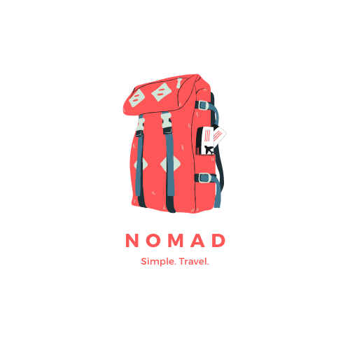
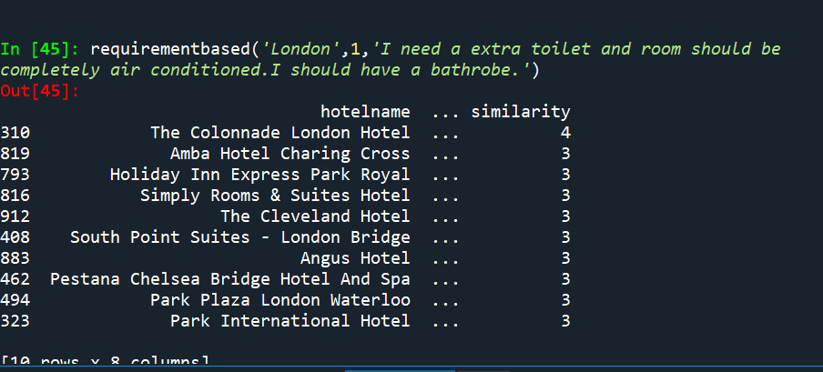

# Background
It is not new that individuals all around the world seek to experience new stuff and learn more about another culture, learning how every country has their own lifestyle. By the mid 20th century, airlines made their way to most countries and made it possible for people to travel to other continents in a matter of hours, replacing the other conventional methods like driving or even riding a train. Airplanes are now considered a conventional way of traveling, but compared to riding a car, airplane tickets have an odd way to manage their pricing. Airplanes tickets can sometimes be extremely cheap and other days they can be overly priced, this is mainly caused by the change in demand throughout the days.
It is hard to keep track when the pricing will rise or decrease, which could ruin one’s budget for a trip. Anyone who seeks to travel, usually save up a sum of money for them to spend however they please, yet sometimes an unexpected rise in the pricing of plane tickets may ruin it. As a result many travelers have fallen into debt after returning from their holiday trips, losing more than $1,100 just from poor budget management. Throughout the years, the poor management of savings have caused Americans to spend around 10% - 15% of their annual income on vacations, and if we take into consideration someone that makes approximately $70,000 a year, that's around $9,000 spent just in one vacation trip.

# Introduction
Since many people are having a hard time dealing with their expenses, we decided to provide a solution to this management problem. Which is where NOMAD comes in, NOMAD is a budget manager that provides a general idea of how much a traveler will have to spend and how much they could save on their trips.  
Mission  
Our mission with NOMAD is to provide a plan service that will help travelers have a stress-free experience.  
Vision
We want to become the best trip service provider that allows any individual to get experiences around the world at the lowest price possible.

# NOMAD Development
According to Merriam Webster, a nomad can be defined as “ a member of a group of people who move from place to place instead of living in one place all the time ”. This is why the name NOMAD is a way to describe our mission of helping others move around the globe acquiring experiences through travel.
Since ancient times, we have always traveled to survive, to find food, and to find better conditions to live. Nowadays, we use travel to learn more about other cultures, and to acknowledge the uniqueness of every single country. 
Unfortunately, sometimes it is difficult to travel to other countries for many reasons, one of them being the lack of knowledge for finding accessible deals for their trips. This can lead people to go to misleading companies that make deals for an overpriced cost, leading people to give up and spend more money than they should.
    With that being said, NOMAD was created to find the best possible trip at the best possible cost allowing the user to declare a budget and organize.

# Why NOMAD?
Nomad is a new, innovative, and simple solution to manage travel expenses, in which people around the globe can use to travel without having to worry of their trip being too expensive.
    Using machine learning, NOMAD can search for the best budget trip for any person in the time desired. 
    This can provide the opportunity to many people to travel and to explore other cultures, which can make the society more inclusive and enlightened.
Thanks to all the planification, this will lower the concern of spending crazy amounts of money. Allowing to increase the enjoyment of the trip without worrying about the monetary factor. 

# How des it work?
NOMAD is an online webpage that guides the user into organizing the best possible trip in terms of price and quality.
NOMAD works by providing different options for airlines, hotels, and touristic destinations, all this by using the information the user provides to the webpage, with a few simple questions. Our software processes the data and searches between the database of associated businesses for the best option. 
Once the user finds what they're looking for, our webpage proceeds to give them a time limit plan, in which it tells them the process they need to follow to reach the goal, this includes daily notifications reminding them how much money they have saved and how much they need.
NOMAD finds the best planned trips for the user utilizing a type of artificial intelligence known as a recommended system on case-based reasoning (CBR). CBR is a system in which the program learns about previous case problems and finds the best solutions for them through experience; when a new problem is presented to the AI, the program looks for a previous case that had a similar problem and finds a solution. If a solution cant be found, the programmer has to add it to the system, so it can be used in future problems. The user provides the program with their budget, travel destinations and other miscellaneous questions, so the program can find similar cases of other users and recommend the best options for the new user.
    We used the method retrieve, reuse, revise, retain for the algorithm as explained above. With this basis we created an algorithm that can adapt to specific requests from the user. Please refer to the attachment below.
    

    
In this particular scenario the function was called with a really specific request from an user. However, the algorithm still managed to give an appropriate answer to such a complex request that is inherently specific to this individual in particular. (The full code for the function can be examined through the github link).
    However, our algorithm presents some major disadvantages. Critics of CBR argue that it is an approach that accepts anecdotal evidence as its main operating principle. Without statistically relevant data for backing and implicit generalization, there is no guarantee that the generalization is correct. However, all inductive reasoning where data is too scarce for statistical relevance is inherently based on anecdotal evidence. There is recent work that develops CBR within a statistical framework and formalizes case-based inference as a specific type of probabilistic inference; thus, it becomes possible to produce case-based predictions equipped with a certain level of confidence. One description of the difference between CBR and induction from instances is that statistical inference aims to find what tends to make cases similar while CBR aims to encode what suffices to claim similarly. 

# Future of NOMAD
The future for NOMAD is driven by an affiliate business model, in which we   work with a range of businesses, from local shops to giant organizations. 
NOMAD provides its service in exchange for a percentage of the earnings the supplier makes. We are working in the making of a bigger reach platform, so we can provide our services in a larger range of places.
A simple example of the service that we provide and how we benefit from it is organized trips, which take tourists to eat at the restaurants that are in our database. And NOMAD receives a commission for each person who eats in the restaurant.
NOMAD rents a space for third parties to place their ads. They are based on the amount of traffic that they are able to derive to the client's website. Hence, the company that needs to attract traffic offers a percentage of earnings to agents that can get these new visitors.

# Closing Statement / Conclusion
The recommender system was able to give accurate recommendations based on prices, characteristics on a hotel, population, and individual requests. This means that if the code was faced with a recommendation and a price limit was applied to it, the program would be able to give that specific recommendation with the functions already created and just filter prices out from the dataset.
It is important to remember that having an adequate organization of money can have a significant positive impact on one’s well-being by avoiding future problems than can come up, giving them peace of mind and making their adventures more exciting. We want to make sure that our users will enjoy each experience their trips can bring, especially since every trip will be providing new experiences and memories. 

“Travel is the only thing you buy that makes you richer.”
-NOMAD

# Bibliography
1.-Merriam-Webster. (n.d.). Nomad. Merriam-Webster.com dictionary. https://www.merriam-webster.com/dictionary/nomad
2.- Dizik, A. (2017). Why so many people overspend on their holidays. BBC. https://www.bbc.com/worklife/article/20170919-why-so-many-people-overspend-on-their-holidays
3.- Liu, J. (2017). Most Americans Are Taking Vacations They Can't Afford. Forbes https://www.forbes.com/sites/learnvest/2017/06/30/most-americans-are-taking-vacations-they-cant-afford/?sh=43c2d071577a

